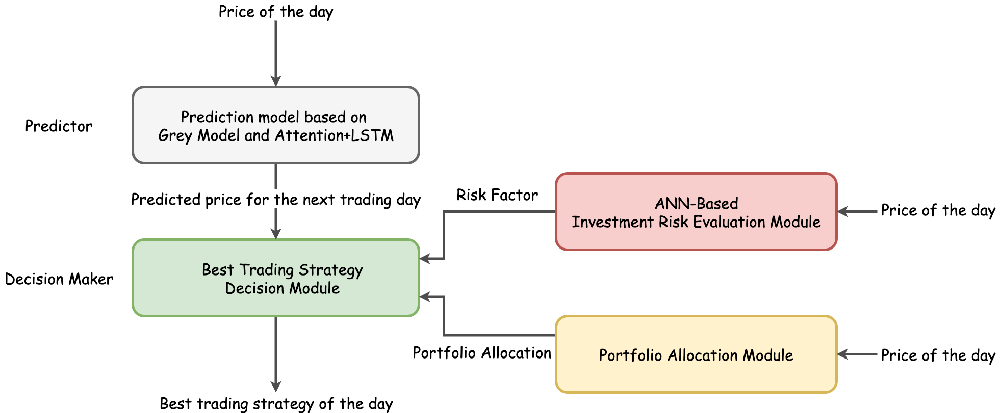
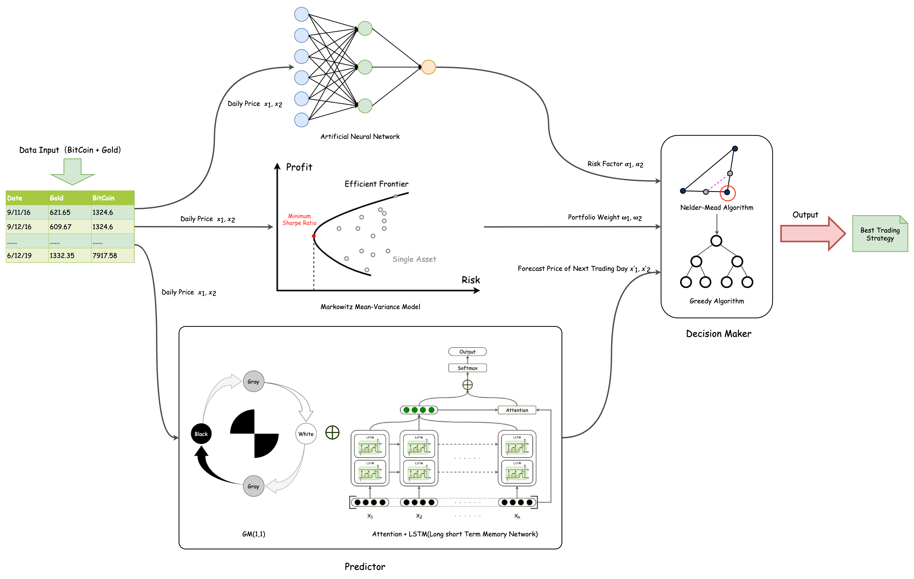
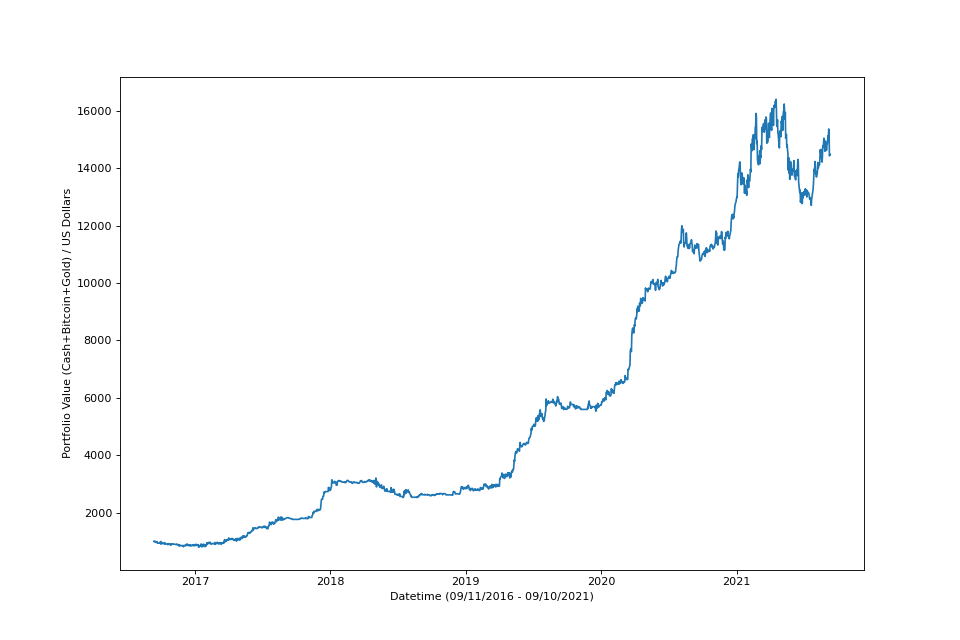

# HALM: A Highly Adaptive Learning Model for Portfolio Decision Making


- [HALM: A Highly Adaptive Learning Model for Portfolio Decision Making](#halm-a-highly-adaptive-learning-model-for-portfolio-decision-making)
  - [1. Introduction](#1-introduction)
    - [1.1. Background](#11-background)
    - [1.2. Overall Architecture](#12-overall-architecture)
    - [1.3. HALM](#13-halm)
    - [1.4. Decision-making Effect on 09/10/2021](#14-decision-making-effect-on-09102021)
  - [2. Tutorial](#2-tutorial)
    - [2.1. Environment Preparation](#21-environment-preparation)
      - [2.1.1 Suggestion](#211-suggestion)
      - [2.1.2 Install Python](#212-install-python)
      - [2.1.2.1. Windows environment](#2121-windows-environment)
        - [A. Installation](#a-installation)
        - [B. Create a virtual environment](#b-create-a-virtual-environment)
        - [C. Use a virtual environment](#c-use-a-virtual-environment)
      - [2.1.2.2. MacOS](#2122-macos)
        - [A. Installation](#a-installation-1)
        - [B. Create a virtual environment](#b-create-a-virtual-environment-1)
        - [C. Use a virtual environment](#c-use-a-virtual-environment-1)
      - [2.1.2.3. Linux](#2123-linux)
        - [A. Install a virtual environment with the Python package management tool pip](#a-install-a-virtual-environment-with-the-python-package-management-tool-pip)
        - [B.After the installation is complete, you can use the virtualenv command to create a virtual environment. You only need to specify the name of a virtual environment.](#bafter-the-installation-is-complete-you-can-use-the-virtualenv-command-to-create-a-virtual-environment-you-only-need-to-specify-the-name-of-a-virtual-environment)
        - [C.To activate the created virtual environment, use the following command](#cto-activate-the-created-virtual-environment-use-the-following-command)
        - [D. To exit the virtual environment use the following command](#d-to-exit-the-virtual-environment-use-the-following-command)
    - [2.2. Install dependency python library](#22-install-dependency-python-library)
    - [2.3. How to run](#23-how-to-run)

## 1. Introduction

### 1.1. Background

There are two main problems in the existing portfolio decision-making process as follows:

* Many portfolio models are now essentially a static model
* Some current new decision models only focus on a specific type of correlation network or use a specific model for
  portfolio optimization, and lack the exploration of portfolio optimization

### 1.2. Overall Architecture



### 1.3. HALM

The overall workflow of the HALM model is shown below. 



### 1.4. Decision-making Effect on 09/10/2021



**Initial Funding:** $1000.00

**Funding for 09/10/2021:** **$14485.35**

Earnings Multiple: About **14.49** times

## 2. Tutorial

### 2.1. Environment Preparation

If you want to do a good job, you must first sharpen your tools. It is more important to make the development environment right than anything else.

#### 2.1.1 Suggestion

* It is recommended to use PyCharm or VSCode, please do not use IDE
* It is recommended to use Python 3.8.X or above
* It is recommended to make the working environment coexist with multiple versions and multiple environments, use
  virtualenv, etc. for isolation, regardless of whether Python 3.8 is used for daily work

#### 2.1.2 Install Python

#### 2.1.2.1. Windows environment

##### A. Installation

* Download the Python 3.8.X installation package and install it, assuming the installation path is C:\Python38, do not set environment variables

```bash
pip install virtualenv
```

##### B. Create a virtual environment

* Open the command line prompt, enter the project folder, take C:\Projects\example_project as an example, if the project uses Python 3.8.X, execute the following command to create a virtual environment

```bash
cd C:\Projects\example_project
virtualenv -p C:\Python38\python.exe venv
```

##### C. Use a virtual environment

* The command line prompt needs to activate the virtual environment before it can be used, including python, pip, etc.

```bash
cd C:\Projects\example_project
.\venv\Scripts\activate.bat
```

The IDE configures the project's Python Interpreter to C:\Projects\example_project\venv\bin\python.exe

#### 2.1.2.2. MacOS

##### A. Installation

* Install Brew, ignore if already installed

```bash
/usr/bin/ruby -e "$(curl -fsSL https://raw.githubusercontent.com/Homebrew/install/master/install)"
```

* Install python 3.8 with Brew

```bash
brew update
brew install python@3.8
```

* Open the terminal and execute the command to install virtualenv

```bash
pip install virtualenv
```

##### B. Create a virtual environment

* Open the command line prompt, enter the project folder, take C:\Projects\example_project as an example, if the project
  uses Python 3.8.X, execute the following command to create a virtual environment

```bash
cd ~/Projects/example_project
virtualenv -p python3 venv
```

##### C. Use a virtual environment

* The command line prompt needs to activate the virtual environment before it can be used, including python, pip, etc.

```bash
cd ~/Projects/example_project
source ./venv/bin/activate
```

The IDE configures the project's Python Interpreter to ~/Projects/example_project/venv/bin/python

#### 2.1.2.3. Linux

##### A. Install a virtual environment with the Python package management tool pip

```bash
sudo pip install virtualenv
```

##### B.After the installation is complete, you can use the virtualenv command to create a virtual environment. You only need to specify the name of a virtual environment.

```bash
virtualenv venv
```

##### C.To activate the created virtual environment, use the following command

```bash
source venv/bin/activate
```

##### D. To exit the virtual environment use the following command

```bash
deactivate
```

### 2.2. Install dependency python library

```bash
pip install -r requirements.txt
```

### 2.3. How to run
```python
from halm import HALM

a = 1000.44  # The closing price of product A on the day
b = 564.11  # The closing price of product B on the day
h_ab = [
    {"2020-11-01": [852.59, 485.44]},
    {"2020-11-02": [891.38, 933.66]},
    {"2020-11-03": [977.14, 996.52]}
]  # Historical closing prices for products A and B
portfolio = HALM(
    price_a=a, price_b=b, historical_prices=h_ab
).halm_decision()  # Portfolio investment strategy for the next trading day
```